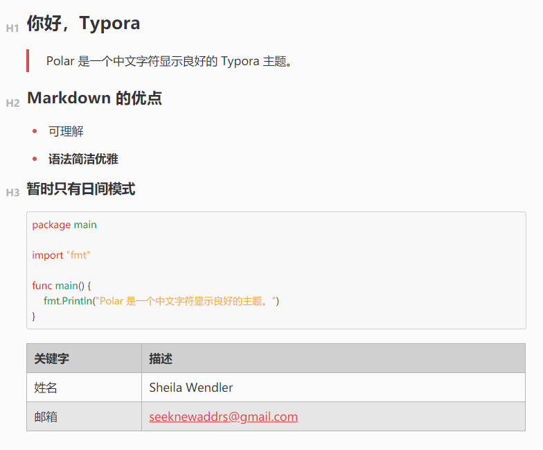

# Polar

因为找不到中文显示还行的主题，于是我不得不自己动手在 [Ursine](https://github.com/aCluelessDanny/typora-theme-ursine) 的基础上改进了字体大小和中文显示效果。

Because I couldn't find a theme that was okay with Chinese characters display, I had to improve the font size and Chinese display effect based on [Ursine](https://github.com/aCluelessDanny/typora-theme-ursine).

另外说明，本人完全不懂 CSS、SCSS。

## Installation

In Typora's preferences windows, go to `General -> Themes` and click on `Open Theme Folder`. Drop all the decompressed files and folders in there, and enjoy!~
